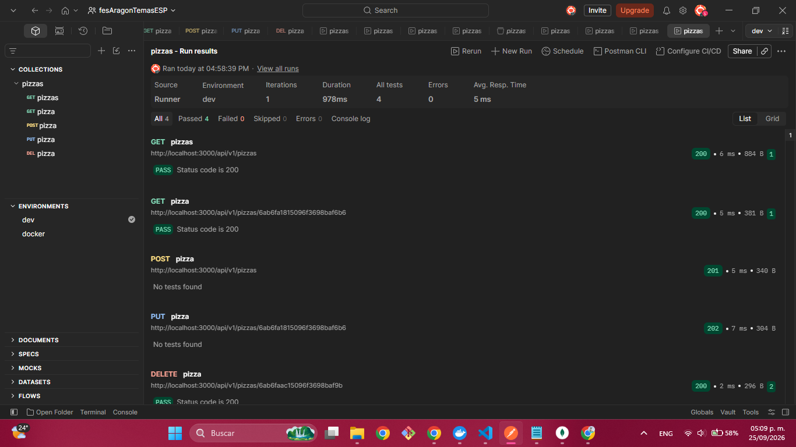

# API de Pizzería con Express y MongoDB

API RESTful desarrollada en Node.js para la gestión e inventario de pizzas. El proyecto implementa operaciones CRUD completas y almacena los datos en un contenedor local de MongoDB.

## Lo que utilice 

* **Node.js** - Entorno de ejecución para JavaScript.
* **Express.js** - Framework web para el manejo de rutas y peticiones HTTP.
* **MongoDB** - Base de datos NoSQL para el almacenamiento persistente.
* **Postman** - Pruebas y automatización de la API REST.

## Funcionalidades

La API cuenta con los siguientes endpoints disponibles bajo la ruta base `/api/v1/pizzas`:

| Método | Endpoint | Descripción | Código HTTP |

| **GET** | `/api/v1/pizzas` | Obtiene la lista completa de pizzas. | `200 OK` |
| **GET** | `/api/v1/pizzas/:id` | Obtiene una pizza específica mediante su `_id` de MongoDB. | `200 OK` / `404 Not Found` |
| **POST** | `/api/v1/pizzas` | Crea una nueva pizza en la base de datos. | `201 Created` |
| **PUT** | `/api/v1/pizzas/:id` | Actualiza la información de una pizza existente. | `202 Accepted` / `404 Not Found` |
| **DELETE** | `/api/v1/pizzas/:id` | Elimina una pizza de la base de datos por su `_id`. | `200 OK` |

## Requisitos

* Node.js v18+ instalado.
* Instancia local o contenedor Docker de MongoDB corriendo en `localhost:27017`.

## Ejecucución 

git clone https://github.com/lauudenn/mongoDBLau.git
cd C:\Users\Usuario\Desktop\mongodb>
   CAPTURA DE PANTALLA 
